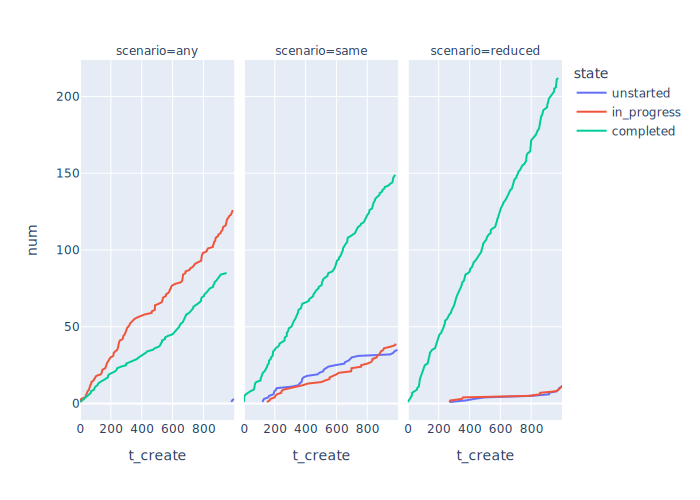

# Feedback

-   Because programmers don't always get it right the first time

## Adding Testers

-   Parameter sweeping once again

```{.python data-file=simple_testing.py}
PARAMS = {
    "n_programmer": (2, 3, 4),
    "n_tester": (2, 3, 4),
    "p_rework": (0.2, 0.4, 0.6, 0.8),
    …as before…
}

def main():
    random.seed(PARAMS["seed"])
    result = []
    combinations = product(PARAMS["n_programmer"], PARAMS["n_tester"], PARAMS["p_rework"])
    for (n_programmer, n_tester, p_rework) in combinations:
        sweep = {"n_programmer": n_programmer, "n_tester": n_tester, "p_rework": p_rework}
        params = {**PARAMS, **sweep}
        sim = Simulation(params)
        sim.run()
        result.append({
            "params": params,
            "lengths": sim.lengths,
            "jobs": [job.as_json() for job in Job._all],
        })
    json.dump(result, sys.stdout, indent=2)
```

-   Two queues

```{.python data-file=simple_testing.py}
class Simulation:
    def __init__(self, params):
        self.params = params
        self.env = Environment()
        self.prog_queue = Store(self.env)
        self.test_queue = Store(self.env)
        self.lengths = []
```

-   Programmers get from one queue and add to another

```{.python data-file=simple_testing.py}
def programmer(sim, worker_id):
    while True:
        job = yield sim.prog_queue.get()
        start = sim.env.now
        yield sim.env.timeout(sim.rand_dev())
        job.n_prog += 1
        job.t_prog += sim.env.now - start
        yield sim.test_queue.put(job)
```

-   Testers get from the second queue and either recirculate the job or mark it as done

```{.python data-file=simple_testing.py}
def tester(sim, tester_id):
    while True:
        job = yield sim.test_queue.get()
        start = sim.env.now
        yield sim.env.timeout(sim.rand_dev())
        job.n_test += 1
        job.t_test += sim.env.now - start
        if sim.rand_rework():
            yield sim.prog_queue.put(job)
        else:
            job.done = True
```

-   Queue lengths

<div class="center">
  
</div>

-   Times for jobs that were started

</div>
  
</div>

-   Gosh, this is hard to understand…

## Using Classes

-   [Simula][simula]: object-oriented programming was invented to support simulation
-   Before making our simulation more realistic, [refactor](g:refactor) to use classes
-   `Simulation` creates objects for programmers and testers
    -   Their classes are responsible for creating and running generators

```{.python data-file=class_testing.py}
class Simulation:
    …all other code as before…
    def run(self):
        Job.clear()
        self.env.process(self.monitor())
        self.env.process(creator(self))
        self.programmers = [Programmer(self, i) for i in range(self.params["n_programmer"])]
        self.testers = [Tester(self, i) for i in range(self.params["n_tester"])]
        self.env.run(until=self.params["t_sim"])
```

-   Generic `Worker` stores a reference to the simulation and its ID
-   Then calls a `.run` method and saves a reference to the generator
    -   In case we want to interrupt it

```{.python data-file=class_testing.py}
class Worker:
    def __init__(self, sim, id):
        self.sim = sim
        self.id = id
        self.proc = sim.env.process(self.run())
```

-   `Programmer` implements `.run`
    -   Identical to previous naked generator except `sim` becomes `self.sim`
-   Similar change to `Tester` (not shown here)

```{.python data-file=class_testing.py}
class Programmer(Worker):
    def run(self):
        while True:
            job = yield self.sim.prog_queue.get()
            job.programmer_id = self.id
            start = self.sim.env.now
            yield self.sim.env.timeout(self.sim.rand_dev())
            job.n_prog += 1
            job.t_prog += self.sim.env.now - start
            yield self.sim.test_queue.put(job)
```

-   We haven't changed the order of operations…
-   …so the random number generator should produce the same values at the same moments…
-   …so we can test our changes by checking that the output of the refactored version
    is identical to the output of the original version

## Exploring Scenarios

-   Option 1: everything that needs re-work goes back in the shared queues
    -   Which means any programmer and tester can pick it up
    -   Which isn't realistic
-   Option 2: work goes back to the same programmer and tester who handled it the first time
    -   Which requires some changes to our simulation
-   Option 3: same as 2, but it takes less time for people to re-do work
    -   Which is realistic…
    -   …except we have to guess at the discount ratio
-   Modify `Worker` constructor to give each worker (programmer or tester) their own queue

```{.python data-file=scenario_testing.py}
class Worker:
    def __init__(self, sim, id):
        self.sim = sim
        self.id = id
        self.queue = Store(sim.env)
        self.proc = sim.env.process(self.run())
```

-   Modify `Programmer` to:
    -   Keep track of which of the shared queues it gets jobs from
    -   Call a method `self.choose()` to get a job (we'll write this in a moment)
    -   Put the completed job in either the all-purpose testing queue (if it hasn't been tested before)
        or the queue belonging to a specific tester (if it has)

```{.python data-file=scenario_testing.py}
class Programmer(Worker):
    def __init__(self, sim, id):
        super().__init__(sim, id)
        self.shared_queue = self.sim.prog_queue  # added

    def run(self):
        while True:
            job = yield from self.choose()  # changed
            job.programmer_id = self.id
            start = self.sim.env.now
            yield self.sim.env.timeout(self.factor() * self.sim.rand_dev())
            job.n_prog += 1
            job.t_prog += self.sim.env.now - start

            # hand off the job
            if job.tester_id is None:
                yield self.sim.test_queue.put(job)
            else:
                yield self.sim.testers[job.tester_id].queue.put(job)
```

-   Similar change to `Tester`
-   Now, how does `self.choose()` work?
    -   Put it in the generic `Worker` class because both `Programmer` and `Tester` need it
    -   This is why we recorded the shared queue in the constructors for `Programmer` and `Tester`

```{.python data-file=scenario_testing.py}
class Worker:
    def choose(self):
        if self.sim.params["scenario"] == "any":
            job = yield self.shared_queue.get()
        elif self.sim.params["scenario"] in ("same", "reduced"):
            job = yield from self.choose_same()
        else:
            assert False, f"unknown scenario {self.sim.params['scenario']}"
        return job
```

-   The hard work is in the `.choose_same` method
    -   Create *but do not immediately `yield`* a request for an item from each queue
    -   `yield` the combination of those items using `|` (a short form for `simpy.AnyOf`)
    -   `result` is dictionary-like object whose keys are the requests
        and whose values are the items that we got
    -   If we got something from our own queue, take that
    -   If not, take what we got from the shared queue
    -   Important: we have to cancel the other request or we can't make another one from that queue
    -   Yes, this took me a while to figure out
    -   And yes, it's safe to cancel a request that wasn't satisfied

```{.python data-file=scenario_testing.py}
    def choose_same(self):
        req_shared = self.shared_queue.get()
        req_own = self.queue.get()
        result = yield (req_shared | req_own)
        if (len(result.events) == 2) or (req_own in result):
            job = result[req_own]
            req_shared.cancel()
        else:
            job = result[req_shared]
            req_own.cancel()
        return job
```

-   So what are the results?

<div class="center">
  
</div>

-   If anyone can do the rework, we wind up with a lot of jobs stuck in progress,
    but very very that haven't even been started
-   If work goes back to the same people *and* it takes them half as long to re-do jobs,
    we complete a lot more work *and* we have less of a backlog
-   The one I didn't predict: if work goes back to the same people but there is no time saving,
    we still complete a lot more jobs
    -   Because we're giving re-work priority over new work
    -   The backlog grows more quickly than in the "anyone can do it"scenario,
        but the number of incomplete jobs grows more slowly
-   This is why we simulate…

[simula]: https://en.wikipedia.org/wiki/Simula
