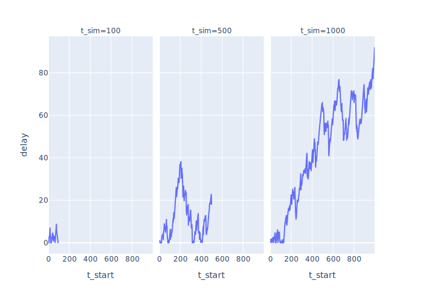
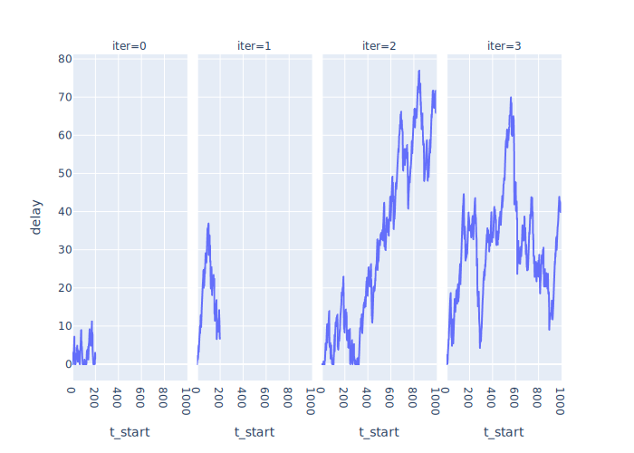
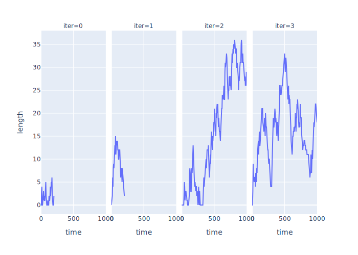
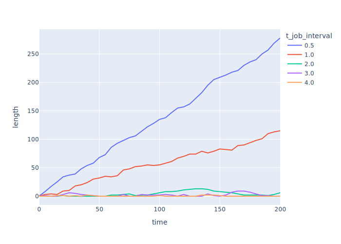
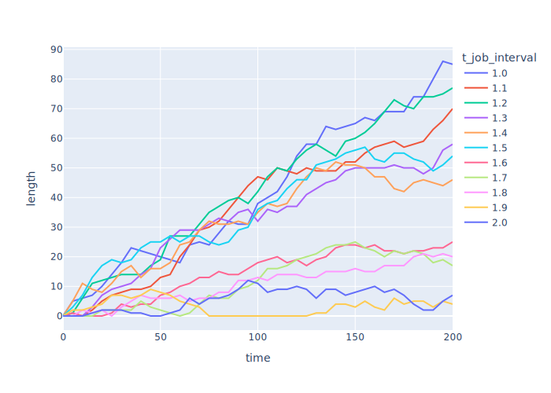

# Simple Metrics

<p id="terms"></p>

## Measuring Delay

-   `Params`

```{.py data-file=measure_delay.py}
@dataclass_json
@dataclass
class Params:
    t_job_interval: float = 2.0
    t_job_mean: float = 0.5
    t_job_std: float = 0.6
    t_sim: float = 10
```

-   `Job` class keeps track of when it was created, started, and completed
    -   `t_start` and `t_complete` may be null
-   Newly-created jobs add themselves to `Job._all` automatically
-   Jobs know how to convert themselves to JSON for persistence
    -   Use `util.rnd(…)` to round values to `PRECISION` decimal places

```{.py data-file=measure_delay.py}
class Job:
    SAVE_KEYS = ["t_create", "t_start", "t_complete"]
    _next_id = count()
    _all = []

    @classmethod
    def reset(cls):
        cls._next_id = count()
        cls._all = []

    def __init__(self, sim):
        Job._all.append(self)
        self.id = next(Job._next_id)
        self.duration = sim.rand_job_duration()
        self.t_create = sim.env.now
        self.t_start = None
        self.t_complete = None

    def json(self):
        return {key: util.rnd(self, key) for key in self.SAVE_KEYS}
```

-   `Simulation`
    -   Remember to reset the record of jobs done at the start of the simulation
    -   Otherwise, data from multiple scenarios will pile up
    -   Yes, this is a design smell and we should fix it

```{.py data-file=measure_delay.py}
@dataclass
class Simulation(Environment):
    def __init__(self):
        super().__init__()
        self.params = Params()
        self.queue = Store(self)

    def simulate(self):
        Job.reset()
        self.queue = Store(self.env)
        self.env.process(manager(self))
        self.env.process(coder(self))
        self.env.run(until=self.params.t_sim)
```

-   `manager` and `coder` are straightforward

```{.py data-file=measure_delay.py}
def manager(sim):
    while True:
        job = Job(sim=sim)
        yield sim.queue.put(job)
        yield sim.env.timeout(sim.rand_job_arrival())


def coder(sim):
    while True:
        job = yield sim.queue.get()
        job.t_start = sim.env.now
        yield sim.env.timeout(job.duration)
        job.t_complete = sim.env.now
```

-   Output with default parameters

```{.txt data-file=measure_delay.txt}
## jobs
shape: (8, 9)
┌──────────┬─────────┬────────────┬──────┬───┬────────────────┬────────────┬───────────┬───────┐
│ t_create ┆ t_start ┆ t_complete ┆ iter ┆ … ┆ t_job_interval ┆ t_job_mean ┆ t_job_std ┆ t_sim │
│ ---      ┆ ---     ┆ ---        ┆ ---  ┆   ┆ ---            ┆ ---        ┆ ---       ┆ ---   │
│ f64      ┆ f64     ┆ f64        ┆ i32  ┆   ┆ f64            ┆ f64        ┆ f64       ┆ i32   │
╞══════════╪═════════╪════════════╪══════╪═══╪════════════════╪════════════╪═══════════╪═══════╡
│ 0.0      ┆ 0.0     ┆ 0.68       ┆ 0    ┆ … ┆ 2.0            ┆ 0.5        ┆ 0.6       ┆ 10    │
│ 3.12     ┆ 3.12    ┆ 3.99       ┆ 0    ┆ … ┆ 2.0            ┆ 0.5        ┆ 0.6       ┆ 10    │
│ 4.69     ┆ 4.69    ┆ 8.33       ┆ 0    ┆ … ┆ 2.0            ┆ 0.5        ┆ 0.6       ┆ 10    │
│ 5.25     ┆ 8.33    ┆ 9.15       ┆ 0    ┆ … ┆ 2.0            ┆ 0.5        ┆ 0.6       ┆ 10    │
│ 6.87     ┆ 9.15    ┆ null       ┆ 0    ┆ … ┆ 2.0            ┆ 0.5        ┆ 0.6       ┆ 10    │
│ 8.84     ┆ null    ┆ null       ┆ 0    ┆ … ┆ 2.0            ┆ 0.5        ┆ 0.6       ┆ 10    │
│ 9.0      ┆ null    ┆ null       ┆ 0    ┆ … ┆ 2.0            ┆ 0.5        ┆ 0.6       ┆ 10    │
│ 9.37     ┆ null    ┆ null       ┆ 0    ┆ … ┆ 2.0            ┆ 0.5        ┆ 0.6       ┆ 10    │
└──────────┴─────────┴────────────┴──────┴───┴────────────────┴────────────┴───────────┴───────┘
```

-   Plot delays for three different simulation durations
    -   This is what we mean by parameter sweeping

```{.py data-file=measure_delay_sweep.py}
if __name__ == "__main__":
    args, results = util.run(Params, Simulation)
    jobs = util.as_frames(results)["jobs"]
    jobs = jobs \
        .filter(pl.col("t_start").is_not_null()) \
        .sort("t_create") \
        .with_columns((pl.col("t_start") - pl.col("t_create")).alias("delay"))
    fig = px.line(jobs, x="t_start", y="delay", facet_col="t_sim")
```

<figure id="f:measure_delay_sweep">
  
  <figcaption>Job delays vs. time</figcaption>
</figure>

## Four Metrics

-   Reminder that we are interested in:
    -   Backlog: how much work is waiting to start vs. time?
    -   Delay: how long from job creation to job start?
    -   Throughput: how many jobs are completed per unit time?
    -   Utilization: how busy are the people on the team?
-   Use classes for processes instead of naked generators
    -   Gives us a place to store extra data *and* access it from outside
-   `Recorder` base class creates unique per-class IDs and saves instances
    -   A generalization of the machinery we build for the `Job` class above
    -   Reset IDs and object lists in between parameter sweeps
    -   Expect derived classes to define `SAVE_KEYS` to identify what to save as JSON

```{.py data-file=four_metrics.py}
class Recorder:
    _next_id = defaultdict(count)
    _all = defaultdict(list)

    @staticmethod
    def reset():
        Recorder._next_id = defaultdict(count)
        Recorder._all = defaultdict(list)

    def __init__(self, sim):
        cls = self.__class__
        self.id = next(self._next_id[cls])
        self._all[cls].append(self)
        self.sim = sim

    def json(self):
        return {key: util.rnd(self, key) for key in self.SAVE_KEYS}
```

-   `Manager` doesn't really need to be a class, but consistency makes code easier to understand

```{.py data-file=four_metrics.py}
class Manager(Recorder):
    def run(self):
        while True:
            job = Job(sim=self.sim)
            yield self.sim.queue.put(job)
            yield self.sim.timeout(self.sim.rand_job_arrival())
```

-   `Coder` keeps track of how much time it has spent working

```{.py data-file=four_metrics.py}
class Coder(Recorder):
    SAVE_KEYS = ["t_work"]

    def __init__(self, sim):
        super().__init__(sim)
        self.t_work = 0

    def run(self):
        while True:
            job = yield self.sim.queue.get()
            job.t_start = self.sim.now
            yield self.sim.timeout(job.duration)
            job.t_complete = self.sim.now
            self.t_work += job.t_complete - job.t_start
```

-   `Monitor` records the length of the queue every few ticks
    -   SimPy `Store` keeps items in a list-like object `queue.items`

```{.py data-file=four_metrics.py}
class Monitor(Recorder):
    def run(self):
        while True:
            self.sim.lengths.append(
                {"time": self.sim.now, "length": len(self.sim.queue.items)}
            )
            yield self.sim.timeout(self.sim.params.t_monitor)
```

-   `Simulation` creates instances *and* calls their `.run()` methods
    -   After resetting all the recording

```{.py data-file=four_metrics.py}
class Simulation:
    # …as before…
    def run(self):
        Recorder.reset()
        self.queue = Store(self.env)
        self.env.process(Manager(self).run())
        self.env.process(Coder(self).run())
        self.env.process(Monitor(self).run())
        self.env.run(until=self.params.t_sim)
```

-   Report results

```{.py data-file=four_metrics.py}
class Simulation:
    # …as before…
    def result(self):
        return {
            "jobs": [job.json() for job in Recorder._all[Job]],
            "coders": [coder.json() for coder in Recorder._all[Coder]],
            "lengths": self.lengths,
        }
```

-   Use [Polars][polars] and [Plotly Express][plotly-express] to analyze and plot
-   Run the simulation twice each for 200 and 1000 ticks

<figure id="f:four_metrics_delay">
  
  <figcaption>Job delays vs. time</figcaption>
</figure>

<figure id="f:four_metrics_backlog">
  
  <figcaption>Backlog vs. time</figcaption>
</figure>

<div class="row" markdown="1">
<div class="col-6" markdown="1">
<div id="t:four_metrics_throughput" data-caption="Throughput" markdown="1">

| id | t_sim | num_jobs | throughput |
|----|-------|----------|------------|
| 0  | 200   | 96       | 0.48       |
| 1  | 200   | 92       | 0.46       |
| 2  | 1000  | 489      | 0.49       |
| 3  | 1000  | 492      | 0.49       |

</div>
</div>
<div class="col-6" markdown="1">
<div id="t:four_metrics_utilization" data-caption="Utilization" markdown="1">

| id | t_sim | total_work | utilization |
|----|-------|------------|-------------|
| 0  | 200   | 172.94     | 0.86        |
| 1  | 200   | 175.23     | 0.88        |
| 2  | 1000  | 947.52     | 0.95        |
| 3  | 1000  | 931.92     | 0.93        |

</div>
</div>
</div>

1.  Backlog and delay track each other pretty closely,
    so we only need to measure one or the other.
2.  Throughput stabilizes right away.
    Utilization takes a little longer,
    but even then the change is pretty small
    as we increase the length of the simulation.

<div class="callout" markdown="1">

Imagine you're the manager in the fourth scenario.
You might panic as backlog starts to rise,
not realizing that it's just random variation.

</div>

## Varying Arrival Rate

-   Vary the job arrival rate from 0.5 to 4.0

<figure id="f:job_arrival_wide">
  
  <figcaption>backlog vs. time with varying job arrival rates</figcaption>
</figure>

-   Seems the backlog either grows or doesn't
-   Zoom in and vary job arrival rate from 1.0 to 2.0

<figure id="f:job_arrival_narrow">
  
  <figcaption>backlog vs. time with narrower range of job arrival rates</figcaption>
</figure>

-   λ (lambda) is the arrival rate: the average number of jobs arriving per unit time
-   μ (mu) is the service rate: the average number of jobs a single server can serve per unit time
-   ρ (rho) is the utilization: the fraction of time the server is busy
-   ρ = λ/μ for single-server systems *if λ < μ*
    -   If λ ≥ μ, the queue grows without limit
-   Average waiting time in queue W = ρ/(μ (1-ρ))
    -   Think of 1-ρ as spare capacity
    -   As the system approaches saturation, waiting times increase rapidly
-   So if all the programmers are busy 100% of the time,
    the waiting time for new work explodes
-   There must be slack in the system in order to keep waiting times down

## Little's Law

-   λ (lambda) is the arrival rate
-   L is the average number of customers in the system
-   W is average time a customer spends in the system
-   [Little's Law](g:littles-law): L = λW
-   Exercise: test this by modifying the simulation to allow multiple coders
