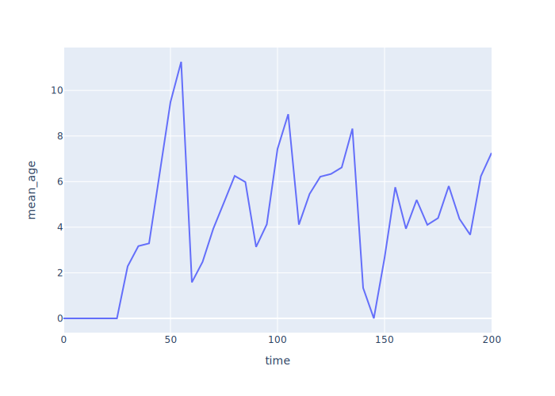
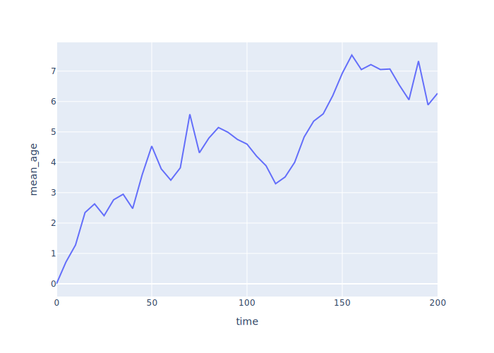
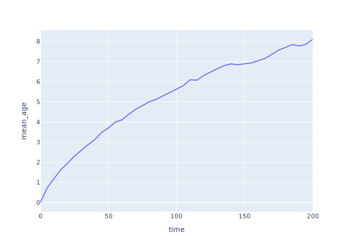
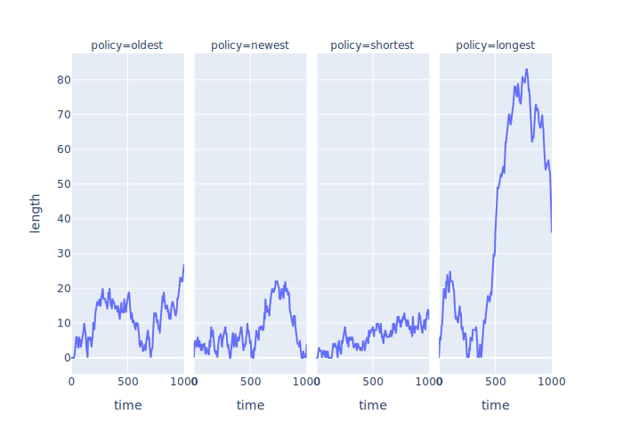
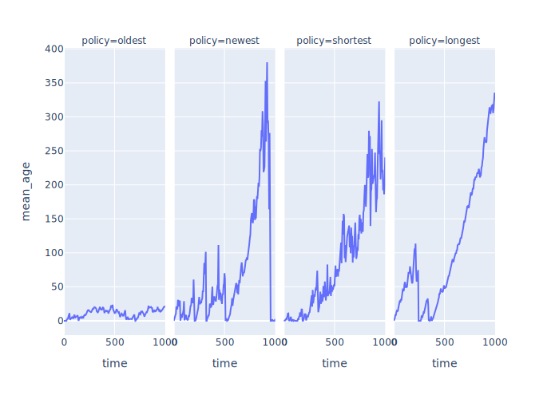
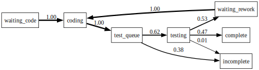

# Exploring Scenarios

<p id="terms"></p>

## Smoothing Over Multiple Runs

-   We have been showing results from individual runs
-   What do results look like when averaged over many runs?
-   Plot job ages vs. time averaged over 1, 10, 100, and 1000 simulations

<div class="row">
  <div class="col-6">
    <figure id="f:smoothing_ages_1">
      
      <figcaption>Ages From 1 Run</figcaption>
    </figure>
  </div>
  <div class="col-6">
    <figure id="f:smoothing_ages_10">
      
      <figcaption>Ages Smoothed Over 10 Runs</figcaption>
    </figure>
  </div>
</div>
<div class="row">
  <div class="col-6">
    <figure id="f:smoothing_ages_100">
      
      <figcaption>Ages Smoothed Over 100 Runs</figcaption>
    </figure>
  </div>
  <div class="col-6">
    <figure id="f:smoothing_ages_1000">
      
      <figcaption>Ages Smoothed Over 1000 Runs</figcaption>
    </figure>
  </div>
</div>

-   Work is piling up
    -   Toward an asymptote or just slowing down?
-   We only get to experience one curve in real life

## Choosing Jobs

-   Four policies:
    -   Oldest job first (same as regular queue)
    -   Newest job first
    -   Longest job first
    -   Shortest job first
-   Implement by:
    -   Using `Queue(self, priority=True)` instead of a plain `Queue`
    -   Adding `__lt__` to `Job` for comparison
    -   Actual comparison depends on policy

```{.py data-file=job_priority.py}
class Params:
    # …as before…
    policy: str = "shortest"

class Job(Recorder):
    # …as before…
    def __lt__(self, other):
        match self.sim.params.policy:
            case "oldest":
                return self.t_create < other.t_create
            case "newest":
                return other.t_create < self.t_create
            case "shortest":
                return self.duration < other.duration
            case "longest":
                return other.duration < self.duration
            case _:
                assert False, f"unknown policy {self.sim.params.policy}"
```

-   Look at effect on backlog over time

<figure id="f:job_priority_backlog">
  
  <figcaption>Job backlog vs. time</figcaption>
</figure>

<figure id="f:job_priority_ages">
  
  <figcaption>Age of jobs in queue vs. time</figcaption>
</figure>

<div class="row" markdown="1">
<div class="col-6" markdown="1">
<div id="t:job_priority_throughput" data-caption="Throughput" markdown="1">

| policy   | t_sim | num_jobs | throughput |
|----------|-------|----------|------------|
| longest  | 1000  | 485      | 0.48       |
| newest   | 1000  | 457      | 0.46       |
| oldest   | 1000  | 497      | 0.5        |
| shortest | 1000  | 509      | 0.51       |

</div>
</div>
<div class="col-6" markdown="1">
<div id="t:job_priority_utilization" data-caption="Utilization" markdown="1">

| policy   | t_sim | total_work | utilization |
|----------|-------|------------|-------------|
| oldest   | 1000  | 934.48     | 0.93        |
| shortest | 1000  | 961.69     | 0.96        |
| newest   | 1000  | 888.03     | 0.89        |
| longest  | 1000  | 974.04     | 0.97        |

</div>
</div>
</div>

## Multiple Workers Redoing Work

-   Our models so far have assumed that when a job is done, it's done
-   In real life, testing often reveals bugs that need rework
-   Start by modeling with a second queue and a group of testers

```{.py data-file=rework_any.py}
class Params:
    # …as before…
    n_tester: int = 1
    p_rework: float = 0.5

class Simulation(Environment):
    def __init__(self):
        # …as before…
        self.test_queue = None

    def simulate(self):
        # …as before…
        self.test_queue = Queue(self)
        for _ in range(self.params.n_tester):
            Tester(self)

class Tester(Process):
    def init(self):
        self.sim = self._env
        # …recorder setup…
        self.t_work = 0

    async def run(self):
        while True:
            job = await self.sim.test_queue.get()
            await self.timeout(job.duration)
            if self.sim.rand_rework():
                await self.sim.code_queue.put(job)
            else:
                job.t_complete = self.sim.now
```

-   Any tester can test any job
-   All jobs needing rework go back in the same queue as new work
    -   And are handled in arrival order, i.e., not given priority
-   But this isn't realistic
-   Give each `Coder` its own rework queue

```{.py data-file=rework_same.py}
class Coder(Process):
    def init(self):
        self.sim = self._env
        # …recorder setup…
        self.rework_queue = Queue(self.sim)
        self._work_event = None
```

-   Have testers give work back to the coder who did the work
    -   Need to add a `coder_id` field to jobs to keep track of this
    -   Call `notify_work()` so the coder stops waiting and checks its rework queue

```{.py data-file=rework_same.py}
class Tester(Process):
    async def run(self):
        while True:
            job = await self.sim.test_queue.get()
            assert job.coder_id is not None
            await self.timeout(job.duration)
            if self.sim.rand_rework():
                coder = self.sim.coders[job.coder_id]
                await coder.rework_queue.put(job)
                coder.notify_work()
            else:
                job.t_complete = self.sim.now
```

-   Now the hard part: coders selecting jobs from two queues
-   Put it in a method of its own
-   Use the notification pattern: wait on a shared event rather than yielding two queue requests at once

```{.py data-file=rework_same.py}
class Coder(Process):
    async def run(self):
        while True:
            job = await self.get()
            await self.timeout(job.duration)
            await self.sim.test_queue.put(job)
```

-   So how does `Coder.get(…)` work?
    -   Check the rework queue first (personal work takes priority)
    -   Then check the shared code queue for new work
    -   If both are empty, wait on a notification event
    -   Producers call `notify_work()` to wake us up when work arrives

```{.py data-file=rework_same.py}
    def notify_work(self):
        """Signal that work may be available."""
        if self._work_event is not None and not self._work_event._triggered:
            self._work_event.succeed()

    async def get(self):
        """Get next job, preferring rework queue over shared queue."""
        while True:
            if not self.rework_queue.is_empty():
                job = await self.rework_queue.get()
                assert job.coder_id == self.id
                return job
            if not self.sim.code_queue.is_empty():
                job = await self.sim.code_queue.get()
                assert job.coder_id is None
                job.coder_id = self.id
                return job
            self._work_event = Event(self.sim)
            await self._work_event
```

-   We can now build a graph showing the [transition probabilities](g:transition-probability)
    for each state that a job might be in
    -   Introduce a state `incomplete` for jobs that aren't finished by the end of the simulation

<figure id="f:rework_same">
  
  <figcaption>Transition Probability Graph</figcaption>
</figure>
