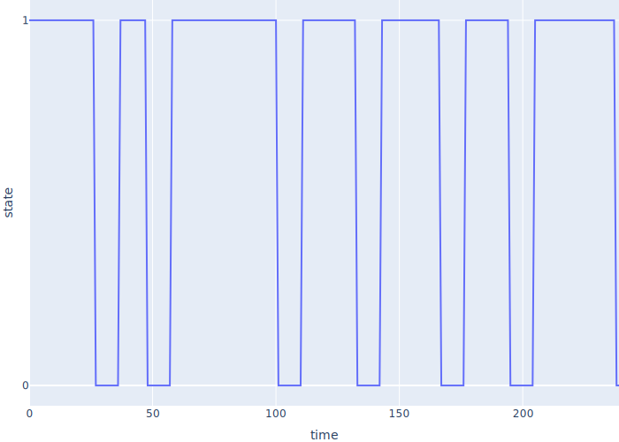

# Simple Simulations

-   FIXME

## A Regular Schedule

-   Shae works on their hobby project for 50 minutes and then takes a 10-minute break
-   Import `Environment` from `simpy`
-   Define a generator to simulate work
    -   <code>env.timeout(<em>duration</em>)</code> creates an object that means "wait this long"
    -   `yield` suspends the worker and gives this object to [SimPy][simpy]
    -   SimPy advances its clock (does *not* actually "wait")

```{.python data-file=fixed_work_and_break.py}
T_WORK = 50
T_BREAK = 10


def worker(env):
    while True:
        print(f"start work at {env.now}")
        yield env.timeout(T_WORK)
        print(f"start break at {env.now}")
        yield env.timeout(T_BREAK)
```

-   To make this work:
    -   Create an `Environment`
    -   Call `worker` to create a generator object
        -   Does *not* execute function yet
	-   Pass in the environment so the generator can call `.timeout`
    -   Tell the environment how long to run

```{.python data-file=fixed_work_and_break.py}
T_MORNING = 4 * 60

if __name__ == "__main__":
    env = Environment()
    proc = worker(env)
    env.process(proc)
    env.run(until=T_MORNING)
    print(f"done at {env.now}")
```

-   Output

```{.out data-file=fixed_work-and_break.out}
start work at 0
start break at 50
start work at 60
start break at 110
start work at 120
start break at 170
start work at 180
start break at 230
done at 240
```

-   FIXME: diagram of execution

## Introducing Randomness

-   Shae starts at the same time but works for variable intervals
    -   So we have to decide how to model those intervals
-   [Uniform](g:random-uniform) is simplest

```{.python data-file=uniform_work_and_break.py}
T_MIN_WORK = 10
T_MAX_WORK = 50


def t_work():
    return random.uniform(T_MIN_WORK, T_MAX_WORK)


def worker(env):
    while True:
        print(f"start work at {env.now}")
        yield env.timeout(t_work())          # changed
        print(f"start break at {env.now}")
        yield env.timeout(T_BREAK)
```
```{.out data-file=uniform_work_and_break.out}
start work at 0
start break at 26.67250326533211
start work at 36.67250326533211
start break at 54.79344793494629
start work at 64.7934479349463
start break at 104.87029408376178
start work at 114.87029408376178
start break at 136.94211951464072
start work at 146.94211951464072
start break at 193.03234415437063
start work at 203.03234415437063
done at 240
```

-   The program runs, but it's not useful
    -   Can't make sense of the output

## Monitoring

-   Create our own `Env` class with `rnow` property to report time to `PREC` decimal places

```{.python data-file=monitor_uniform_work_and_break.py}
PREC = 3


class Env(Environment):
    @property
    def rnow(self):
        return round(self.now, PREC)
```

-   Record start and end events in a list of dictionaries
    -   Easy to convert to a dataframe

```{.python data-file=monitor_uniform_work_and_break.py}
def worker(env, log):
    while True:
        log.append({"event": "start", "time": env.rnow})
        yield env.timeout(t_work())
        log.append({"event": "end", "time": env.rnow})
        yield env.timeout(T_BREAK)
```

-   Move main body into a function
-   Initialize random number generation for reproducibility
    -   Testing and debugging are very difficult otherwise
-   Output a structured log
    -   Use JSON

```{.python data-file=monitor_uniform_work_and_break.py}
SEED = 12345

def main():
    seed = int(sys.argv[1]) if len(sys.argv) > 1 else SEED
    random.seed(seed)
    env = Env()
    log = []
    proc = worker(env, log)
    env.process(proc)
    env.run(until=T_MORNING)
    json.dump(log, sys.stdout, indent=2)
```
```{data-file=monitor_uniform_work_and_break.json}
[
  {
    "event": "start",
    "time": 0
  },
  {
    "event": "end",
    "time": 26.665
  },
  …more events…
  {
    "event": "end",
    "time": 237.149
  }
]]}
```

## Visualization

-   Could put the visualization in the simulation
-   But may want to visualize the data in many different ways

```{.python data-file=visualize_uniform_work_and_break.py}
import json
import plotly.express as px
import polars as pl
import sys

df = pl.from_dicts(json.load(sys.stdin)).with_columns(
    pl.when(pl.col("event") == "start").then(1).otherwise(-1).alias("delta")
)
events = df.with_columns(
    pl.col("delta").cum_sum().alias("state")
)

fig = px.line(events, x="time", y="state", line_shape="hv")
fig.update_layout(margin={"l": 0, "r": 0, "t": 0, "b": 0}).update_yaxes(tickvals=[0, 1])
fig.write_image(sys.argv[1])
```

<div class="center">
  
</div>

-   The visualization code is 2/3 the size of the simulation
    -   And arguably harder to read if you're not familiar with [Polars][polars]
        and [Plotly Express][plotly-express]
-   *Understanding a simulation is as much work as building it*

## Logging via Instrumentation

-   Use a [context manager](g:context-manager) to create log entries
    -   `__enter__` adds a "start" event
    -   `__exit__` adds an "end" event
-   Work backwards from desired change in `worker`

```{.python data-file=context_manager_log.py}
def worker(env, log):
    while True:
        with LogWork(env, log):
            yield env.timeout(t_work())
        yield env.timeout(T_BREAK)
```

-   Create the `LogWork` class
    -   Don't need to save the instance in a variable

```{.python data-file=context_manager_log.py}
class LogWork:
    def __init__(self, env, log):
        self.env = env
        self.log = log

    def __enter__(self):
        self.log.append({"event": "start", "time": self.env.rnow})

    def __exit__(self, exc_type, exc_value, traceback):
        self.log.append({"event": "end", "time": self.env.rnow})
```

-   Accurate reporting
-   But we have to insert monitoring into our worker
    -   And as it becomes more complex, that's going to be harder to read

## Simulating with Objects

-   Create a class to represe the worker
    -   Its `run` method is a generator
    -   Its constructor creates the process 

```{.python data-file=simulate_with_objects.py}
class Worker:
    def __init__(self, env):
        self.env = env
        self.env.process(self.run())

    def run(self):
        while True:
            print(f"{self.env.rnow} start")
            yield self.env.timeout(t_work())
            print(f"{self.env.rnow} end")
            yield self.env.timeout(T_BREAK)
```

-   Main body just creates the object

```{.python data-file=simulate_with_objects.py}
def main():
    seed = int(sys.argv[1]) if len(sys.argv) > 1 else SEED
    random.seed(seed)
    env = Env()
    worker = Worker(env)
    env.run(until=T_MORNING)
```
```{.python data-file=simulate_with_objects.out}
0 start
26.665 end
36.665 start
47.072 end
57.072 start
100.08 end
110.08 start
132.025 end
142.025 start
166.762 end
176.762 start
194.508 end
204.508 start
237.149 end
```

## Logging via Sampling

-   Define another process that inspects the worker periodically and records its state

```{.python data-file=sampling_log.py}
class Logger:
    def __init__(self, env, worker):
        self.env = env
        self.worker = worker
        self.log = []
        self.env.process(self.run())

    def run(self):
        while True:
            self.log.append({"time": self.env.rnow, "state": self.worker.state})
            yield self.env.timeout(T_LOG)
```

-   Modify the worker to make its state explicit
    -   Initialize in constructor and update in `run`

```{.python data-file=sampling_log.py}
class Worker:
    def __init__(self, env):
        self.env = env
        self.state = "idle"
        self.env.process(self.run())

    def run(self):
        while True:
            self.state = "work"
            yield self.env.timeout(t_work())
            self.state = "idle"
            yield self.env.timeout(T_BREAK)
```

<div class="center">
  
</div>

-   Instrumentation is easier in simple systems
-   Sampling is easier in complex ones
-   [Separation of concerns](g:separation-of-concerns)

## Exercises

1.  Why are the edges in the second plot not quite vertical?
