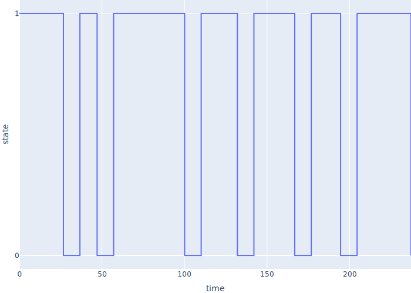

# Simple Simulations

-   Start with a few simple simulations to illustrate [SimPy][simpy]
-   The framework relies on generators, which are briefly summarized in [this appendix](@/generators/)

## A Regular Schedule

-   Shae works on their hobby project for 50 minutes and then takes a 10-minute break
-   Import `Environment` from `simpy`
-   Define a generator to simulate work
    -   <code>env.timeout(<em>duration</em>)</code> creates an object that means "wait this long"
    -   `yield` suspends the worker and gives this object to SimPy
    -   SimPy advances its clock (does *not* actually "wait")

```{.python data-file=fixed_work_and_break.py}
T_WORK = 50
T_BREAK = 10


def worker(env):
    while True:
        print(f"start work at {env.now}")
        yield env.timeout(T_WORK)
        print(f"start break at {env.now}")
        yield env.timeout(T_BREAK)
```

-   To make this work:
    -   Create an `Environment`
    -   Call `worker` to create a generator object
        -   Does *not* execute the function (yet)
	-   Pass in the environment so the generator can call `env.timeout`
    -   Tell the environment how long to run

```{.python data-file=fixed_work_and_break.py}
T_MORNING = 4 * 60

if __name__ == "__main__":
    env = Environment()
    proc = worker(env)
    env.process(proc)
    env.run(until=T_MORNING)
    print(f"done at {env.now}")
```

-   Output

```{.out data-file=fixed_work-and_break.out}
start work at 0
start break at 50
start work at 60
start break at 110
start work at 120
start break at 170
start work at 180
start break at 230
done at 240
```

-   FIXME: diagram of execution
-   `env.timeout()` doesn't actually pause the process
-   It creates an object telling the framework how long the process wants to pause
-   `yield` gives this object to the framework
-   [Co-operative concurrency](g:coop-concurrency)
    -   Completely deterministic unless we deliberately introduce randomness

## Introducing Randomness

-   Shae starts at the same time but works for variable intervals
    -   So we have to decide how to model those intervals
-   [Uniform random distribution](g:random-uniform) is unrealistic, but simple

```{.python data-file=uniform_work_and_break.py}
T_MIN_WORK = 10
T_MAX_WORK = 50


def rand_work():
    return random.uniform(T_MIN_WORK, T_MAX_WORK)


def worker(env):
    while True:
        print(f"start work at {env.now}")
        yield env.timeout(rand_work())          # changed
        print(f"start break at {env.now}")
        yield env.timeout(T_BREAK)
```
```{.out data-file=uniform_work_and_break.out}
start work at 0
start break at 26.67250326533211
start work at 36.67250326533211
start break at 54.79344793494629
start work at 64.7934479349463
start break at 104.87029408376178
start work at 114.87029408376178
start break at 136.94211951464072
start work at 146.94211951464072
start break at 193.03234415437063
start work at 203.03234415437063
done at 240
```

-   Is this working correctly?
-   Hard for us to make sense of the output

## Monitoring

-   Round the time to `PREC` decimal places
-   Record start and end events in a list of dictionaries
    -   Easy to convert to a dataframe

```{.python data-file=monitor_uniform_work_and_break.py}
def worker(env, log):
    while True:
        log.append({"event": "start", "time": env.rnow})
        yield env.timeout(rand_work())
        log.append({"event": "end", "time": env.rnow})
        yield env.timeout(T_BREAK)
```

-   Move main body into a function
-   Initialize random number generation for reproducibility
    -   Testing and debugging are very difficult otherwise
-   Output a structured log as JSON

```{.python data-file=monitor_uniform_work_and_break.py}
SEED = 12345

def main():
    seed = int(sys.argv[1]) if len(sys.argv) > 1 else SEED
    random.seed(seed)
    env = Environment()
    log = []
    proc = worker(env, log)
    env.process(proc)
    env.run(until=T_MORNING)
    json.dump(log, sys.stdout, indent=2)
```
```{data-file=monitor_uniform_work_and_break.json}
[
  {"event": "start", "time": 0},
  {"event": "end", "time": 26.665},
  …more events…
  {"event": "end", "time": 237.149}
]
```

## Visualization

-   Could put the visualization in the simulation
-   But may want to visualize the data in many different ways

```{.python data-file=visualize_uniform_work_and_break.py}
import json
import plotly.express as px
import polars as pl
import sys

df = pl.from_dicts(json.load(sys.stdin)).with_columns(
    pl.when(pl.col("event") == "start").then(1).otherwise(-1).alias("delta")
)
events = df.with_columns(
    pl.col("delta").cum_sum().alias("state")
)

fig = px.line(events, x="time", y="state", line_shape="hv")
fig.update_layout(margin={"l": 0, "r": 0, "t": 0, "b": 0}).update_yaxes(tickvals=[0, 1])
fig.write_image(sys.argv[1])
```

<div class="center">
  
</div>

-   The visualization code is 2/3 the size of the simulation
    -   And arguably harder to read if you're not familiar with [Polars][polars]
        and [Plotly Express][plotly-express]
-   *Understanding a simulation is as much work as building it*

## Managers and Programmers

-   Shae's manager gives them work
    -   Need a process to generate tasks
    -   And a way for the manager to give them to Shae
-   Use `simpy.Store` to model a [job queue](g:job-queue)
    -   First-in, first-out
    -   Infinite capacity (for now)
-   FIXME: diagram
-   Setup

```{.python data-file=manager_developer_queue.py}
T_JOB_ARRIVAL = (20, 30)
T_WORK = (10, 50)
PREC = 3

def rt(env):
    return round(env.now, PREC)

def rand_job_arrival():
    return random.uniform(*T_JOB_ARRIVAL)

def rand_work():
    return random.uniform(*T_WORK)
```

-   Manager puts things in queue
    -   As with `env.timeout`,
        `queue.put` creates an object that we `yield` to the framework
-   Then wait a random interval before creating the next job
-   Use `itertools.count` and `next()` to generate a sequence of integer job IDs

```{.python data-file=manager_developer_queue.py}
def manager(env, queue, log):
    job_id = count()
    while True:
        log.append({"time": rt(env), "id": "manager", "event": "create job"})
        yield queue.put(next(job_id))
        yield env.timeout(rand_job_arrival())
```

-   Programmer takes jobs from the queue in order
    -   The logging code makes this harder to read

```{.python data-file=manager_developer_queue.py}
def programmer(env, queue, log):
    while True:
        log.append({"time": rt(env), "id": "worker", "event": "start wait"})
        job = yield queue.get()
        log.append({"time": rt(env), "id": "worker", "event": "start work"})
        yield env.timeout(rand_work())
        log.append({"time": rt(env), "id": "worker", "event": "end work"})
```

-   Main program sets things up, runs the simulation, and displays the log

```{.python data-file=manager_developer_queue.py}
T_SIM = 100
SEED = 12345

def main():
    seed = int(sys.argv[1]) if len(sys.argv) > 1 else SEED
    random.seed(seed)

    env = Environment()
    queue = Store(env)
    log = []

    env.process(manager(env, queue, log))
    env.process(programmer(env, queue, log))
    env.run(until=T_SIM)

    json.dump(log, sys.stdout, indent=2)
```
```{.out data-file=manager_developer_queue.json}
[
  {"time": 0, "id": "manager", "event": "create job"},
  {"time": 0, "id": "worker", "event": "start wait"},
  {"time": 0, "id": "worker", "event": "start work"},
  {"time": 10.407, "id": "worker", "event": "end work"},
  {"time": 10.407, "id": "worker", "event": "start wait"},
  …more events…
  {"time": 92.57, "id": "worker", "event": "start wait"}
]
```

## Interesting Questions

-   [Throughput](g:throughput): how many jobs get done per unit time?
-   [Delay](g:delay): how long from job creation to job completion?
-   [Utilization](g:utilization): how busy is the programmer?
-   We need better data collection
-   So define a class `Job`
    -   Every job has a unique ID
    -   `Job` stores the log of job-related events

```{.python data-file=job_object.py}
class Job:
    _id = count()
    _log = []

    def __init__(self, env):
        self.env = env
        self.id = next(Job._id)
        self.log("created")

    def log(self, message):
        Job._log.append({"time": rt(self.env), "id": self.id, "event": message})
```

-   Manager and programmer

```{.python data-file=job_object.py}
def manager(env, queue):
    while True:
        yield queue.put(Job(env))
        yield env.timeout(rand_job_arrival())


def programmer(env, queue):
    while True:
        job = yield queue.get()
        job.log("start")
        yield env.timeout(rand_work())
        job.log("end")
```

-   Save the parameters in the output for reproducibility

```{.python data-file=job_object.py}
def main():
    …as before…
    params = {
        "seed": seed,
        "t_sim": t_sim,
        "t_job_arrival": T_JOB_ARRIVAL,
        "t_work": T_WORK,
    }
    result = {
        "params": params,
        "tasks": Job._log,
    }
    json.dump(result, sys.stdout, indent=2)
```

| id | created | start  | end    |
|----|---------|--------|--------|
| 0  | 0.0     | 0.0    | 10.407 |
| 1  | 18.332  | 18.332 | 40.278 |
| 2  | 44.837  | 44.837 | 62.583 |
| 3  | 62.205  | 62.583 | 79.05  |
| 4  | 83.525  | 83.525 | null   |
| 5  | 96.01   | null   | null   |


-   Throughput: number of completed tasks over simulation time
-   Delay: average of end time minus creation time for completed tasks
-   Programmer utilization
    -   Drop tasks that haven't been started
    -   Fill `null` end values with simulation time
    -   Sum the differences between end and start, and divide by simulation time

| metric      | value  |
| ----------- | -----: |
| throughput  |  0.040 |
| delay       | 16.736 |
| utilization |  0.830 |

-   But this is only for 100 ticks
-   How do these figures change as we run the simulation for longer periods?

| duration | throughput | delay     | utilization |
| -------: | ---------: | --------: | ----------: | 
|      100 |      0.040 |    16.736 |       0.830 |
|     1000 |      0.038 |    76.904 |       0.961 |
|    10000 |      0.034 |  1537.582 |       0.996 |
|   100000 |      0.033 | 16412.712 |       1.000 |

-   Throughput and utilization stabilize, delay steadily increases
    -   The manager is creating work faster than the programmer can do it
    -   So the programmer is busy all the time
    -   Which is the limit on throughput  
